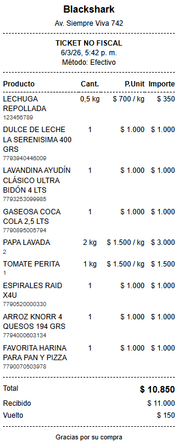
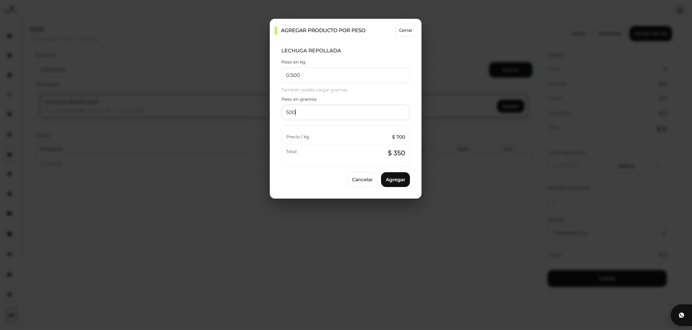
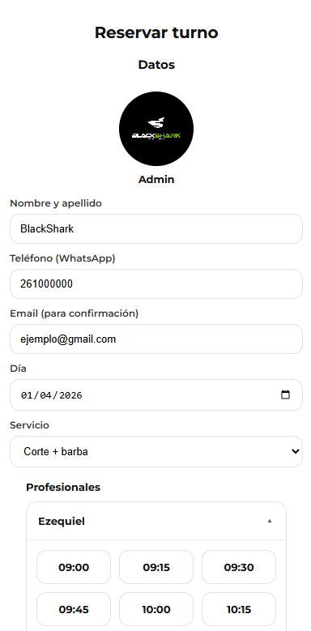

# 👋 Hi, I'm Ezequiel Vidal

<h3 align="center">Full-Stack Developer | Data Analyst | SaaS Builder</h3>

  🇦🇷 Full-Stack Developer and Data Analyst from Argentina

---

  

---

## 🚀 About Me

- Building SaaS products with real users
- Focused on backend architecture and REST APIs
- Developing multi-tenant and scalable systems
- Combining software development and data analysis for real business impact

---

## 🌐 Live Products

### 🧠 Blackshark CRM
👉 https://crm.blackshark.com.ar

SaaS CRM platform for managing clients, sales and operations.

- Multi-tenant architecture
- REST APIs with PHP backend
- AI integration for data queries
- Real client usage

---

### 📅 Booked (Booking SaaS)
👉 https://booked.blackshark.com.ar

Appointment management platform for businesses.

- Built with PHP + JavaScript
- Multi-tenant system
- REST API architecture
- +35 active clients in the first month

---

### 🌍 Blackshark Website
👉 https://blackshark.com.ar

Main website and product ecosystem.

---

### 📱 Booked Mobile App
Mobile version of the booking platform.

- Built with Flutter (Dart)
- REST API integration
- Currently in development

---

### 🎥 Bionix
Video analytics SaaS platform.

- Python agent for camera connection
- RTSP streaming integration
- Real-time metrics and monitoring
- SaaS architecture

---

## 📸 Screenshots

### 🧠 Blackshark CRM

#### AI Module

  

#### Ticket Module

  

#### Sales by Weight

  

---

### 📅 Booked Web

#### Screen 1

  

#### Screen 2

  

#### Screen 3

  

#### Screen 4

  

---

## 🛠 Tech Stack

  

---

## 📊 GitHub Stats

  

  

  

---

## ⚡ Currently Building

- Scaling Booked SaaS
- Expanding Blackshark CRM features
- Developing Bionix

---

## 👀 Visitors

  

---

## 📫 Contact

  

  📧 pezequielvidal@gmail.com

